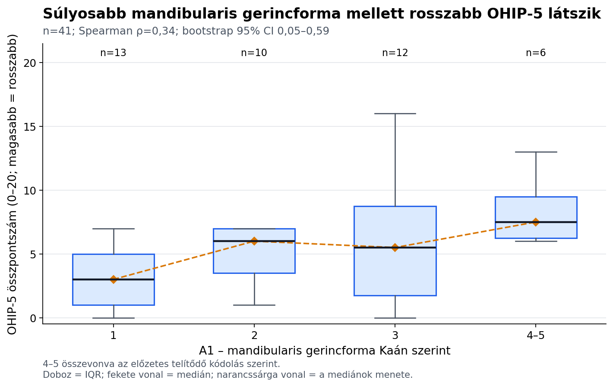

# Mandibularis gerincforma és orális életminőség

**Kisebb scope-ú TDK keresztmetszeti pilot elemzés — 2026-08-19**

## Egy mondatos eredmény

A mandibularisan fogatlan, teljes lemezes fogpótlásra jelentkező betegekben a
súlyosabb, Kaán szerinti mandibularis gerincforma mérsékelten együtt járt a
rosszabb OHIP-5 életminőséggel (`rho=+0,34`;
bootstrap 95%-os CI `0,05; 0,59`; `n=41`),
de az elemzés feltáró és keresztmetszeti, ezért nem bizonyít prognosztikai vagy
okozati kapcsolatot.

## Javasolt TDK-cím

> **A mandibularis gerincforma és az orális egészséggel összefüggő
> életminőség kapcsolata: keresztmetszeti pilotvizsgálat**

## Kutatási kérdés és hipotézis

**Kérdés:** Együtt jár-e a kedvezőtlenebb mandibularis gerincforma a rosszabb
kiindulási, orális egészséggel összefüggő életminőséggel?

**Irányhipotézis:** A magasabb A1 kategória mellett magasabb, azaz rosszabb
OHIP-5 összpontszám várható.

Ez a szűkítés egyetlen klinikai expozíciót, egyetlen primer kimenetet és
egyetlen primer asszociációs becslést tartalmaz. Nem része az anatómiai
összpontszám, a MAI, a GOHAI, a mediáció, az interakciók vagy a sok
tételenkénti teszt.

## Anyag és módszer

- **Dizájn:** másodlagos, keresztmetszeti pilot elemzés.
- **Forrásadat:** 48 betegrekord; mandibularisan releváns
  (`both` vagy `lower`) rekord 41.
- **Elemzési populáció:** teljes A1–OHIP-5 adatpárral 41 beteg.
- **Prediktor:** A1, mandibularis gerincforma Kaán szerint. Az előzetes
  szakértői specifikáció telítődő monoton kódolása: 1→0, 2→1/3, 3→2/3,
  4–5→1.
- **Primer kimenet:** OHIP-5 összpontszám, 0–20; magasabb érték rosszabb
  életminőséget jelent. Csak mind az öt tétel meglétekor számítottuk.
- **Primer becslés:** Spearman-rangkorreláció, 20 000
  betegszintű bootstrap ismétlésből származó percentilis 95%-os intervallummal
  és 20 000 ismétléses kétoldali permutációs
  p-értékkel.
- **Érzékenységi modell:** HC3-robusztus lineáris regresszió életkorra,
  nemre és `both` vs. `lower` fogsortípusra korrigálva. Ez a hiányzó
  kovariánsok miatt 35 teljes esetet használ.

## Eredmények

| A1 kategória | n | OHIP-5 átlag (SD) | Medián [IQR] |
|---:|---:|---:|---:|
| 1 | 13 | 4,3 (5,3) | 3,0 [1,0–5,0] |
| 2 | 10 | 6,7 (5,3) | 6,0 [3,5–7,0] |
| 3 | 12 | 6,6 (6,3) | 5,5 [1,8–8,8] |
| 4 | 3 | 10,3 (2,5) | 10,0 [9,0–11,5] |
| 5 | 3 | 6,3 (0,6) | 6,0 [6,0–6,5] |

Az elsődleges kapcsolat `rho=+0,34` volt
(bootstrap 95%-os CI `0,05; 0,59`; kétoldali
permutációs `p=0,030`). Az egyes betegek
egyenkénti kihagyásakor a rho `+0,31` és
`+0,41` között maradt, tehát az irány nem egyetlen
megfigyelésen múlt.

A korrigált érzékenységi modellben a legkedvezőbb (1) és a telített
legkedvezőtlenebb (4–5) gerincforma közötti becsült OHIP-5-különbség
`+4,78` pont volt (HC3 95%-os CI
`+0,50; +9,06`;
`p=0,029`). Ez érzékenységi eredmény, nem a primer
rangkorreláció helyettesítője.

**Ábra alternatív leírása:** Az A1 gerincforma 1-től 4–5 felé romló
kategóriáiban az OHIP-5 eloszlása összességében felfelé tolódik, de a
csoportokon belüli szóródás nagy és átfedő.

## Mit lehet állítani a TDK-n?

> A vizsgált keresztmetszeti pilotmintában a kedvezőtlenebb mandibularis
> gerincforma mérsékelt, várt irányú kapcsolatot mutatott a rosszabb OHIP-5
> életminőséggel. A becslés további mintán történő megerősítést igényel; a
> jelen eredmény nem igazolja, hogy a gerincforma előre jelzi az új fogsor
> sikerét vagy az életminőség későbbi változását.

Kerülendő megfogalmazás: „a gerincatrophia rontja az életminőséget”, „az A1
bizonyított prediktor”, illetve „szignifikáns eredmény miatt a hipotézis
igazolódott”.

## Kötelező korlátok

1. A kérdés a teljes projekt korábbi feltáró elemzései után lett kiválasztva.
   A permutációs p-érték ezért leíró/tájékoztató, nem prospektíven
   preregisztrált megerősítő teszt.
2. A keresztmetszeti dizájn nem állapít meg időbeliséget vagy okságot.
3. A minta kicsi, különösen a 4-es és 5-ös kategóriákban; ezért ezeket az
   előzetes telítődő specifikációval összhangban az ábrán összevontuk.
4. Az OHIP-5 betegjelzett kimenet. A mechanikai stabilitást, retenciót vagy a
   kezelés utáni változást ez az elemzés nem vizsgálja.
5. A korrigált modell csak 35 teljes esetet tartalmaz, ezért
   érzékenységi ellenőrzésként értelmezendő.
6. A kezelésre jelentkező minta nem reprezentál automatikusan minden teljesen
   fogatlan beteget.

## Rövid TDK-absztrakt vázlat

**Bevezetés:** A mandibularis gerinc sorvadása ronthatja a teljes lemezes
fogsor alátámasztását és stabilitását, de nem egyértelmű, hogy a klinikai
gerincforma mennyiben tükröződik a beteg által megélt orális
életminőségben.

**Cél:** A Kaán szerinti mandibularis gerincforma és a kiindulási OHIP-5
összpontszám keresztmetszeti kapcsolatának becslése.

**Módszer:** 41 mandibularisan fogatlan beteg adatain Spearman-
korrelációt számítottunk telítődő ordinális A1-kódolással, bootstrap
konfidenciaintervallummal és permutációs p-értékkel. Életkorra, nemre és a
fogatlan állcsontok számára korrigált robusztus regresszió készült
érzékenységi elemzésként.

**Eredmény:** A súlyosabb gerincforma rosszabb OHIP-5 felé mutatott
(`rho=+0,34`; 95%-os CI
`0,05; 0,59`). A kapcsolat iránya minden egyes
beteg kihagyása után megmaradt. A korrigált modell hasonló irányú becslést
adott, de kevesebb teljes esetből.

**Következtetés:** A klinikai mandibularis gerincforma a beteg által megélt
orális életminőség egyik lehetséges jelzője lehet, de az eredmény
hipotézisgeneráló és független, prospektív megerősítést igényel.

## Reprodukálhatóság és adatvédelem

- Elemzőszkript: `tdk_a1_ohip_analysis.py`
- Aggregált eredmény: `stat_output/tdk_a1_ohip_summary.json`
- Aggregált kategóriatáblázat: `stat_output/tdk_a1_ohip_by_category.csv`
- Ábra: `stat_output/tdk_a1_ohip_figure.png`
- A kimenetek nem tartalmaznak nevet, TAJ-számot vagy betegszintű exportot.
