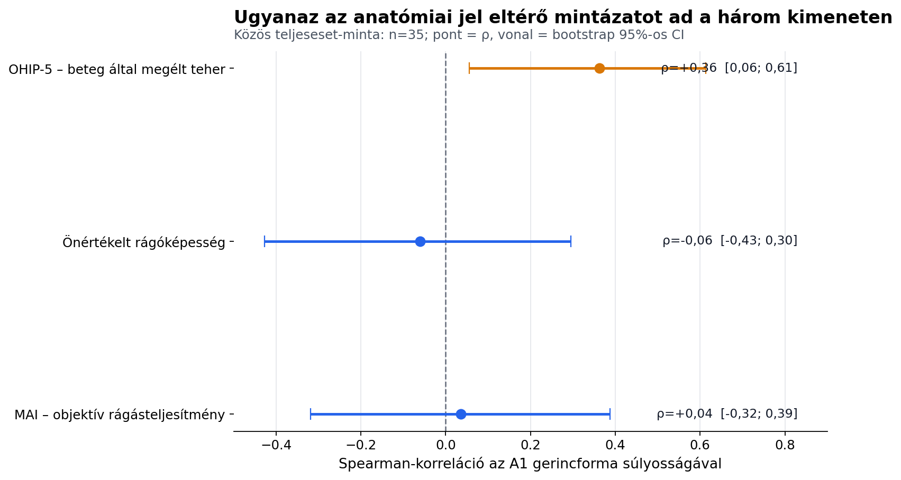

# A mandibularis gerincforma kimeneti profilja

**Kisebb scope-ú TDK keresztmetszeti pilot elemzés — 2026-08-19**

## Miért jobb kérdés ez?

A klinikailag kedvezőtlen anatómia és a rosszabb betegállapot egyszerű
összekapcsolása közel tautologikus. A jelen elemzés ezért nem azt kérdezi,
hogy a „rossz anatómia rossz-e”, hanem azt, hogy **ugyanaz az anatómiai
súlyosság hol jelenik meg**:

1. a beteg által megélt összetett teherben (OHIP-5),
2. a közvetlen önértékelt rágóképességben, vagy
3. az objektív színkeveréses rágásteljesítményben (MAI).

## Javasolt TDK-cím

> **A mandibularis gerincforma kimeneti profilja: objektív
> rágásteljesítmény vagy beteg által megélt teher?**

## Fő eredmény

Ugyanazon 35 betegben a súlyosabb A1 gerincforma az OHIP-5-tel
mérsékelt kapcsolatot mutatott (`rho=+0,36`),
miközben az objektív MAI-jal (`rho=+0,04`) és
a közvetlen önértékelt rágóképességgel
(`rho=-0,06`) nulla körüli pontbecslést,
de széles bizonytalansági intervallumot adott. Ez **eltérő kimeneti
pilotmintázat**, nem bizonyított mechanizmus vagy kapcsolatnélküliség.

## Anyag és módszer

- **Dizájn:** másodlagos, keresztmetszeti, feltáró pilot elemzés.
- **Forrás:** 48 betegrekord; mandibularisan releváns
  (`both` vagy `lower`) beteg 41.
- **Közös teljeseset-minta:** A1, OHIP-5, önértékelt rágóképesség és MAI
  együttes megléte mellett `n=35`. A közös minta
  biztosítja, hogy a korrelációk különbsége ne eltérő betegösszetételből
  adódjon.
- **Prediktor:** A1 Kaán szerinti gerincforma, előzetesen rögzített telítődő
  monoton kódolással: 1→0; 2→1/3; 3→2/3; 4–5→1.
- **Kimenetek:** mindháromnál a magasabb érték rosszabbat jelent: OHIP-5
  0–20, önértékelt rágás 1–5, MAI huedegree.
- **Becslés:** Spearman-korreláció, 50 000
  betegszintű bootstrap ismétlésből származó percentilis 95%-os
  intervallummal. A két korrelációkülönbséget ugyanabban a bootstrap
  mintában számítottuk.
- **Stabilitás:** minden beteget egyenként kihagyó leave-one-out ellenőrzés.

## Eredmények

| Kimenet | n | Spearman ρ | Bootstrap 95%-os CI | LOO-tartomány |
|---|---:|---:|---:|---:|
| OHIP-5 – beteg által megélt teher | 35 | +0,36 | 0,06; 0,61 | 0,32; 0,41 |
| Önértékelt rágóképesség | 35 | -0,06 | -0,43; 0,30 | -0,14; -0,01 |
| MAI – objektív rágásteljesítmény | 35 | +0,04 | -0,32; 0,39 | -0,03; 0,11 |

**Ábra alternatív leírása:** Az A1–OHIP-5 korreláció pozitív és a bootstrap
intervalluma nem éri el a nullát. Az A1–önértékelt rágás és A1–MAI becslése
nulla körüli, széles intervallummal.

### A korrelációk közvetlen összevetése

- OHIP-5 mínusz MAI: `Delta rho=+0,33`;
  bootstrap 95%-os CI `-0,13;
  0,76`.
- OHIP-5 mínusz önértékelt rágás:
  `Delta rho=+0,42`; bootstrap 95%-os CI
  `0,04;
  0,81`.

Az OHIP–MAI különbség iránya érdekes, de az intervallum a nullát is
tartalmazza; ebből nem állítható biztos kimenetspecificitás. Az OHIP és az
egytételes önértékelés különbsége pontosabb, de részben a két mérőeszköz
eltérő információtartalmából is adódhat.

## TDK-n védhető következtetés

> A vizsgált pilotmintában a klinikai mandibularis gerincforma súlyossága
> a többdimenziós betegteherrel mutatott kapcsolatot, miközben az objektív
> színkeveréses teljesítmény és az egytételes globális rágásértékelés
> becslése nulla körüli és bizonytalan volt. A mintázat felveti, hogy az
> anatómiai, objektív funkcionális és betegjelzett kimenetek nem kezelhetők
> automatikusan egymás helyettesítőiként. Ennek megerősítéséhez nagyobb,
> prospektíven tervezett minta szükséges.

Ez érdemben különbözik attól az állítástól, hogy „a rossz anatómia rossz”:
a klinikai döntési kérdés az, hogy **melyik kimenetet kell mérni**, ha a
betegterhet vagy a mechanikai teljesítményt akarjuk megérteni.

## Szakirodalmi kontextus

Az objektív és szubjektív rágásmérés egyezése a teljesfogsor-viselőkben nem
lezárt kérdés. Egy 2024-es vizsgálatban az objektív mérés a harapási erővel
és az okkluzális kontaktussal, a szubjektív mérés pedig az életminőséggel és
a tápláltsággal járt együtt; a két mérési mód között nem tudtak egyezést
kimutatni. Más vizsgálatok ugyanakkor mérsékelt kapcsolatot találtak, tehát
a jelen eredmény nem egyszerűen ismert tény reprodukciója.

- [Wongcharee és mtsai., 2024 – szubjektív és objektív rágás teljesfogsor-viselőkben](https://he02.tci-thaijo.org/index.php/mdentjournal/article/view/267362)
- [Yamamoto és Shiga, 2018 – rágásteljesítmény és OHRQoL](https://www.sciencedirect.com/science/article/pii/S1883195818300069)
- [Campos és mtsai., 2018 – technikai minőség, rágási hatékonyság és életminőség](https://pubmed.ncbi.nlm.nih.gov/29120095/)

## Kötelező korlátok

1. A kérdés a korábbi adatfeltárás után lett kijelölve, ezért az eredmény
   hipotézisgeneráló; nincs prospektíven preregisztrált megerősítő teszt.
2. Az OHIP-5, a globális rágásértékelés és a MAI nem azonos reliabilitású és
   skálájú mérőeszközök. A korrelációkülönbség részben mérési pontossági
   különbség lehet.
3. A közös minta csak 35 beteg; a nulla körüli
   MAI-korreláció intervalluma széles, ezért nincs bizonyíték ekvivalenciára
   vagy valódi kapcsolatnélküliségre.
4. A keresztmetszeti elemzés nem állapít meg okságot, prognózist vagy
   kezelésre adott választ.
5. A jelen MAI egy adott teszt és feldolgozási módszer eredménye; a
   következtetés nem általánosítható automatikusan minden objektív
   rágásvizsgálatra.
6. A kezelésre jelentkező betegminta szelektált.

## Reprodukálhatóság és adatvédelem

- Elemzőszkript: `tdk_a1_outcome_profile_analysis.py`
- Aggregált eredmény: `stat_output/tdk_a1_outcome_profile_summary.json`
- Aggregált korrelációs tábla: `stat_output/tdk_a1_outcome_profile.csv`
- Ábra: `stat_output/tdk_a1_outcome_profile.png`
- A kimenetek nem tartalmaznak nevet, TAJ-számot vagy betegszintű adatot.
