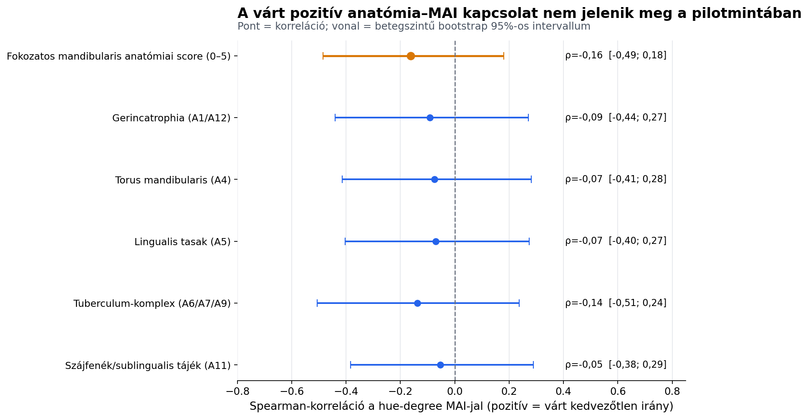

# Mandibularis anatómia és hue-degree MAI

**Kisebb scope-ú TDK keresztmetszeti pilot elemzés — 2026-08-19**

## A kérdés

> Együtt jár-e a nagyobb, előre meghatározott mandibularis anatómiai
> hátrányterhelés a rosszabb objektív rágásteljesítménnyel, ha azt kizárólag
> a hue-degree MAI-jal mérjük?

Ebben az elemzésben nincs OHIP, GOHAI, önértékelt rágás, Lab-algoritmus vagy
RGB-algoritmus. Egyetlen kimenet van: a kiindulási `init_mai_huedegree`.

## A rövid válasz

A várt pozitív kapcsolat nem jelent meg. A fokozatos 0–5 anatómiai score és
a hue-degree MAI korrelációja `rho=-0,16`
volt (`n=33`, bootstrap 95%-os CI `-0,49;
0,18`, kétoldali permutációs `p=0,365`).
Az öt anatómiai komponens pontbecslése szintén nulla körüli, enyhén negatív
volt.

Ez nem bizonyítja, hogy az anatómia funkcionálisan érdektelen. Azt mutatja,
hogy a jelen mintában ez a klinikai anatómiai score nem követi a kiindulási,
teljes szájra vonatkozó színkeverési teljesítményt.

## Javasolt TDK-cím

> **A mandibularis anatómiai hátrányterhelés és az objektív
> rágásteljesítmény kapcsolata hue-degree MAI-val: keresztmetszeti
> pilotvizsgálat**

## Anyag és módszer

- **Dizájn:** másodlagos, keresztmetszeti pilot elemzés.
- **Deduplikálás:** 48 rekordból
  47 egyedi beteg; 1
  duplikált betegcsoportot a legteljesebb rekord megtartásával oldottunk fel.
  Az elemzési változókban konfliktus nem volt.
- **Célpopuláció:** `both` vagy `lower`, azaz mandibularisan releváns
  fogsortípus, összesen 40 egyedi beteg.
- **Hue-degree MAI:** 34 betegben
  elérhető. A magasabb körkörös hue-szórás rosszabb színkeverést jelent.
- **Primer prediktor:** öt, egyenlő súlyú konstrukció fokozatos 0–5 összege:
  gerincatrophia, torus mandibularis, lingualis tasak, tuberculum-komplex és
  szájfenék.
- **Tuberculum:** A6, A7 és A9. Az A8-at az ismert A7–A8 validációs
  inkonzisztencia miatt előre kizártuk.
- **Primer becslés:** Spearman-korreláció, 20 000
  betegszintű bootstrap ismétlésből származó 95%-os intervallummal és
  20 000 ismétléses kétoldali permutációs
  p-értékkel.
- **Szekunder elemzés:** az öt konstrukció külön-külön; a p-értékekre
  Holm-korrekció készült.
- **Érzékenység:** ugyanazon öt konstrukció egész pontos 0–5 score-ja.

## Eredmények

| Anatómiai prediktor | n | Spearman ρ | Bootstrap 95%-os CI | Permutációs p | Holm-p* |
|---|---:|---:|---:|---:|---:|
| Fokozatos mandibularis anatómiai score (0–5) | 33 | -0,16 | -0,49; 0,18 | 0,365 | — |
| Gerincatrophia (A1/A12) | 34 | -0,09 | -0,44; 0,27 | 0,600 | 1,000 |
| Torus mandibularis (A4) | 33 | -0,07 | -0,41; 0,28 | 0,697 | 1,000 |
| Lingualis tasak (A5) | 34 | -0,07 | -0,40; 0,27 | 0,690 | 1,000 |
| Tuberculum-komplex (A6/A7/A9) | 34 | -0,14 | -0,51; 0,24 | 0,439 | 1,000 |
| Szájfenék/sublingualis tájék (A11) | 34 | -0,05 | -0,38; 0,29 | 0,763 | 1,000 |

\* A Holm-korrekció csak az öt komponensből álló másodlagos tesztcsaládra
vonatkozik; a primer score nincs ebben a korrekcióban.

**Ábra alternatív leírása:** A primer anatómiai score és mind az öt
komponens korrelációs pontbecslése a nulla negatív oldalán van. Minden
bootstrap intervallum széles és átmetszi a nullát.

### Stabilitás és érzékenység

- A primer rho az egyes betegek kihagyásakor `-0,25` és
  `-0,08` között mozgott; az előjel nem egyetlen betegen
  múlt.
- Az egész pontos 0–5 score korrelációja
  `rho=-0,29` volt (95%-os CI
  `-0,60; 0,05`).
- A fokozatos és bináris score egyaránt a szakmailag várt iránnyal
  ellentétes pontbecslést adott, de egyik sem zárja ki a nullát.

## A tanulság

> A klasszikus mandibularis anatómiai nehézség és a hue-degree MAI nem
> ugyanannak a mechanikai jelenségnek az automatikus leképezése. A jelen
> pilotmintában az anatómiai hátrányterhelés nem azonosította a rosszabb
> objektív színkeverési teljesítményt.

Ennek egyik lehetséges magyarázata, hogy a hue-degree MAI-t az anatómia
mellett a meglévő protézis technikai minősége, az okklúzió, a neuromuszkuláris
alkalmazkodás és a választott rágási stratégia is meghatározza. Ezeket a jelen
elemzés nem méri, ezért magyarázatként, nem bizonyított mechanizmusként kell
kezelni.

## Mit lehet és mit nem lehet állítani?

**Védhető:**

> Nem találtunk bizonyítékot arra, hogy a nagyobb mandibularis anatómiai
> hátrányterhelés rosszabb kiindulási hue-degree MAI-jal járna együtt.

**Nem védhető:**

- „Az anatómia nem befolyásolja a rágást.”
- „A kedvezőtlen anatómia javítja a rágást.”
- „A hue-degree MAI érvénytelen.”

## Korlátok

1. A primer teljes score–MAI elemzés csak 33 betegből készült.
2. A kérdés a korábbi adatfeltárás után lett leszűkítve; ezért a p-érték
   tájékoztató és az eredmény hipotézisgeneráló.
3. A score szakértőileg meghatározott formatív index, nem külső mintán
   validált mérőeszköz.
4. A MAI teljes száji teljesítmény, miközben a score csak mandibularis
   anatómiai tulajdonságokat tartalmaz.
5. A meglévő protézis minősége, okklúziója, viselési ideje és a neuromuszkuláris
   adaptáció nincs a modellben.
6. A keresztmetszeti baseline MAI nem kezelés utáni eredmény és nem
   prognosztikai végpont.
7. A nulla körüli eredmény nem ekvivalenciabizonyíték; az intervallumok
   mérsékelt pozitív kapcsolatot is megengednek.

## Reprodukálhatóság és adatvédelem

- Elemzőszkript: `tdk_anatomy_huedegree_analysis.py`
- Aggregált eredmény: `stat_output/tdk_anatomy_huedegree_summary.json`
- Aggregált eredménytábla: `stat_output/tdk_anatomy_huedegree_results.csv`
- Ábra: `stat_output/tdk_anatomia_huedegree_forest.png`
- A kimenetek nem tartalmaznak nevet, TAJ-számot vagy betegszintű adatot.
